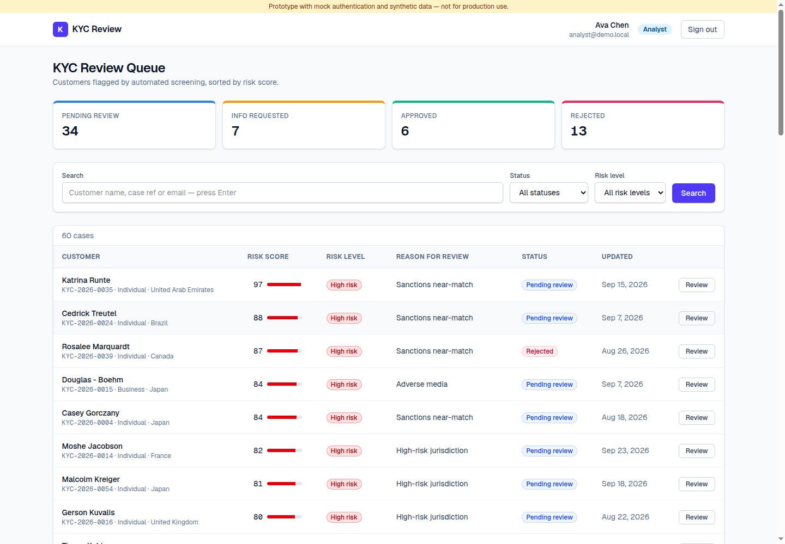

# KYC Review — internal compliance application

An internal **KYC (Know Your Customer) review** application for a hypothetical Series C fintech, built to evaluate
whether a custom application can replace a Microsoft Power Apps KYC solution. Compliance analysts work a queue of
customers flagged by screening, gather evidence, and approve / reject / request more information; high-risk
decisions go through four-eyes approval; every action lands in an append-only audit trail.

> **Not production-ready.** Password login is **mock authentication** for demos. Microsoft Entra ID sign-in,
> Azure Blob storage, screening webhooks and Teams notifications are implemented but have only been exercised
> against local mocks. All data is **synthetic** (Faker); nothing connects to a real customer, KYC, screening,
> banking or payment system.



## Quick start

Requirements: **Node.js 20+**, npm and **Docker** (for PostgreSQL).

```bash
docker compose up -d       # PostgreSQL 16 on :5432 (databases kyc and kyc_test)
npm install                # also runs `prisma generate`
cp .env.example .env       # local defaults: Postgres URL, dev-only secrets, local file storage
npm run setup              # apply migrations + seed synthetic data
npm run dev                # http://localhost:3000
```

Optional local integrations (no credentials needed):

```bash
npm run mock:oidc                  # mock "Sign in with Microsoft" on :4010 (see Entra section)
npm run simulate:screening -- 3    # send 3 signed synthetic screening alerts to the app
```

| Script | Purpose |
| --- | --- |
| `npm run dev` / `npm run build` / `npm start` | Dev server / production build / serve |
| `npm test` | Unit + integration tests (Vitest; recreates the `kyc_test` database from migrations) |
| `npm run test:e2e` | Playwright golden-path tests (run `npm run build` first; **resets and reseeds `DATABASE_URL`**) |
| `npm run lint` / `npm run typecheck` | ESLint / TypeScript |
| `npm run db:reset` / `npm run db:migrate` | Drop + re-migrate + re-seed (dev) / apply pending migrations (deploy) |
| `npm run mock:oidc` | Local OpenID Connect provider imitating Entra ID |
| `npm run simulate:screening -- [n]` | Signed synthetic webhook alerts |
| `npm run outbox:dispatch` | Deliver pending Teams notifications (scheduled job in Azure) |

## Demo credentials

| Role | Email | Password | Notes |
| --- | --- | --- | --- |
| Analyst | `analyst@demo.local` | `analyst123` | Ava Chen — has assigned cases, including high-risk ones needing evidence |
| Analyst | `analyst2@demo.local` | `analyst123` | Sam Patel — second analyst for assignment demos |
| Admin | `admin@demo.local` | `admin123` | Marcus Reid — approvals, rules, exports |
| Admin | `admin2@demo.local` | `admin123` | Dana Brooks — second Admin for four-eyes demos |

With `npm run mock:oidc` running and the mock Entra variables set (see below), **Sign in with Microsoft** offers
Priya Nair (`KYC.Analyst`), Jordan Lee (`KYC.Admin`) and Casey Morgan (no role — refused).

### Suggested demo script (≈5 minutes)

1. **Analyst** → *My open cases*. Show SLA badges, the overdue view, search and filters.
2. Open a **High risk** case assigned to Ava (e.g. `KYC-2026-0005`). Approve/Reject are replaced by
   **Submit for approval**. The evidence checklist shows what the review reason requires; submitting an approval
   recommendation is blocked until it is uploaded. Upload a PDF, recommend approval, submit.
3. Sign in as **Admin** (Marcus). The bell shows a notification; open the case and **Approve**. Try the same with
   a case *you* submitted to see the four-eyes block ("a different Admin must decide it").
4. **Audit history** shows every step: actor, role, status change, recommendation, rule version, notes, uploads.
5. **Rules** (Admin): change an SLA or the evidence matrix, publish v2, and show it applies immediately.
6. **Dashboard**: aging, SLA compliance, throughput, reviewer stats, and CSV exports.
7. Run `npm run simulate:screening -- 2` and show new cases arriving "via screening webhook".

## Features

| Area | What's implemented |
| --- | --- |
| Queue | Status cards; views *All / My open cases / Unassigned / Awaiting my approval / Overdue*; search (name, case ref, email); status + risk filters; assignee and SLA columns. URL-driven, filtered in the database. |
| Case review | Customer profile, screening reason and score, masked document info, assignment panel, evidence, decision panel, audit timeline. |
| Workflow | Enforced state machine, configurable note requirements, optimistic-concurrency protection against stale pages. |
| Ownership | Claim / unassign / Admin reassign; analysts can only act on cases assigned to them. |
| Four-eyes | Configured risk levels must be submitted with a recommendation and decided by a **different** Admin. |
| SLA | Due dates from the active rules per risk level; overdue badges and view; clock restarts on reopen. |
| Evidence | Upload PDF/PNG/JPEG (type checked by magic bytes, 10 MB max, SHA-256 recorded); per-reason checklist; optional approval gate. Local disk or Azure Blob storage. |
| Rules as data | Admin editor for thresholds, approval matrix, four-eyes levels, SLA hours, required notes and evidence. Published versions are immutable and recorded on every audit event. |
| Identity | Mock password login and/or Microsoft Entra ID (OIDC + PKCE) with app-role → role mapping and just-in-time provisioning. |
| Screening | `POST /api/webhooks/screening`, HMAC-signed with replay window, idempotent on event ID and alert ID. |
| Notifications | In-app notifications; Teams Adaptive Cards via a transactional outbox with retries. |
| Reporting | Dashboard (open, overdue, awaiting approval, SLA met, time to decision, aging, 14-day throughput, reviewer stats); Admin CSV export of cases and the audit log. |
| Operations | `/api/health`, security headers, Dockerfile (standalone, non-root), GitHub Actions CI, Azure Bicep groundwork. |

## Business rules

### Status transitions

```
                     ┌──── Request info ────▶ INFO_REQUESTED ──── Reject ───────────────┐
                     │◀─── Mark info received ──────┘                                    │
  created ─▶ PENDING_REVIEW ── Approve / Reject (non-four-eyes risk) ─▶ APPROVED / REJECTED
                     │                                                    ▲         │
                     └── Submit for approval ─▶ PENDING_APPROVAL ─────────┘         │
                         (four-eyes risk,         │  Approve / Reject (different Admin)
                          recommendation)         └── Send back ─▶ PENDING_REVIEW    │
                                                                                     │
                     APPROVED / REJECTED ── Reopen (Admin) ─▶ PENDING_REVIEW ◀───────┘
```

| From | Action | To | Default rule |
| --- | --- | --- | --- |
| Pending review | Approve | Approved | Not for four-eyes risk levels; required evidence present |
| Pending review | Reject | Rejected | Note required; not for four-eyes risk levels |
| Pending review | Request more info | Info requested | Note required |
| Pending review | Submit for approval | Pending approval | Four-eyes risk levels only; recommendation + note required; approve recommendations need evidence |
| Info requested | Mark info received | Pending review | — |
| Info requested | Reject | Rejected | Note required |
| Pending approval | Approve / Reject | Approved / Rejected | Admin who did **not** submit it |
| Pending approval | Send back | Pending review | Admin, note required |
| Approved / Rejected | Reopen | Pending review | Admin, note required; new SLA due date |

### Permissions (default rule set v1)

| Action | Analyst | Admin |
| --- | --- | --- |
| View queue, cases, dashboard | ✓ | ✓ |
| Claim an unassigned case / unassign own case | ✓ | ✓ |
| Assign or reassign to someone else | ✗ | ✓ |
| Act on / upload to a case | Only when assigned to them | Any open case |
| Approve / Reject Low & Medium risk | ✓ | ✓ |
| Submit High risk for approval | ✓ | ✓ |
| Decide a pending approval | ✗ | ✓ (not their own submission) |
| Reopen, edit rules, export CSV | ✗ | ✓ |

Default thresholds: score `0–39` Low, `40–69` Medium, `70–100` High. Default SLAs: High 24h, Medium 72h, Low 120h.

## Integrations

All integrations are off or mocked by default and switched on with environment variables (see `.env.example`).

### Microsoft Entra ID sign-in

1. Create an app registration (single tenant, *Web* platform) with redirect URI `https://<host>/auth/entra/callback`.
2. Under **App roles**, add `KYC.Analyst` and `KYC.Admin` (allowed member type: users/groups) and assign them to
   users or groups in *Enterprise applications*. Admin wins if both are assigned; users with neither are refused.
3. Set `AUTH_ENTRA_TENANT_ID`, `AUTH_ENTRA_CLIENT_ID`, `AUTH_ENTRA_CLIENT_SECRET`. Password login switches off
   automatically unless `AUTH_MOCK_ENABLED=true`.

The flow is authorization code + PKCE with `state` and `nonce`; the ID token is verified against the tenant JWKS
(issuer, audience, expiry). Users are matched by Entra object ID (then email), provisioned just in time, and their
role and name are re-synced on every sign-in. Deactivated users (`active = false`) are refused, and every request
re-reads the user from the database.

Local mock: run `npm run mock:oidc` and set `AUTH_OIDC_ISSUER=http://localhost:4010`,
`AUTH_ENTRA_CLIENT_ID=kyc-review-local`, `AUTH_ENTRA_CLIENT_SECRET=mock-secret`, `AUTH_MOCK_ENABLED=true`.

Behind a proxy (e.g. a shared preview URL where only the app port is reachable), build and start the app with
`MOCK_OIDC_PROXY_TARGET=http://localhost:4010` so `/auth/mock-oidc/*` is served from the app origin, set
`APP_BASE_URL` to the public app URL, and start the mock with `MOCK_OIDC_PUBLIC_URL=<public app URL>/auth/mock-oidc`.

### Screening webhook

`POST /api/webhooks/screening` with header `x-kyc-signature: t=<unix seconds>,v1=<hex HMAC-SHA256 of "<t>.<raw body>">`
using `SCREENING_WEBHOOK_SECRET`, and optionally `x-kyc-provider: <name>`. Signatures older than 5 minutes are
rejected; bodies are limited to 64 KB.

```json
{
  "eventId": "evt_123", "alertId": "alert_456", "occurredAt": "2026-10-01T09:00:00Z",
  "customer": { "name": "…", "type": "INDIVIDUAL", "dateOfBirth": "1980-05-01", "nationality": "Canada",
                "countryOfResidence": "Canada", "email": "…", "phone": "…", "address": "…",
                "occupation": "…", "documentType": "Passport", "documentNumberLast4": "1234" },
  "alert": { "reason": "PEP_MATCH", "score": 85, "detail": "…" }
}
```

Responses: `201` created, `200` duplicate (same `eventId` or `alertId`), `401` bad signature, `422` invalid
payload. A real vendor (ComplyAdvantage, World-Check, …) needs a small adapter mapping its payload and signature
scheme to this contract.

### Teams notifications

Set `TEAMS_WEBHOOK_URL` to a Teams *Workflows* "When a Teams webhook request is received" URL. Messages (case submitted
for approval, new high-risk screening alert) are written to `OutboxMessage` in the same
transaction as the business change, sent right after, and retried by `npm run outbox:dispatch` up to 5 attempts.
Without a URL they are marked `SKIPPED`. In-app notifications (bell icon) always work.

### Document storage

`STORAGE_DRIVER=local` (default) writes to `LOCAL_STORAGE_DIR`. `STORAGE_DRIVER=azure` uses
`AZURE_STORAGE_CONNECTION_STRING` + `AZURE_STORAGE_CONTAINER`; `docker compose --profile azure up -d` starts Azurite
for local testing. Documents are served only to signed-in users through `/api/documents/<id>` with `no-store`
and a restrictive CSP.

## Architecture

```
Browser ── React Server Components + small client forms
   │
Next.js 15 (App Router, one Node process)
   ├─ middleware.ts ──────────── session gate (public: /login, /auth/*, /api/health, /api/webhooks/*)
   ├─ app/(app)/* ────────────── queue, case detail, dashboard, notifications, admin/rules
   ├─ Server Actions ─────────── decisions, assignment, uploads, rule publishing
   ├─ Route handlers ─────────── Entra callback, screening webhook, documents, CSV export, health
   │
   ├─ lib/kyc/service.ts ─────── transaction { load → rules → authz + workflow → compare-and-set update
   │                                            → audit event → notifications → outbox }
   │     ├─ lib/kyc/workflow.ts ── pure state machine (transitions, notes, four-eyes, evidence)
   │     ├─ lib/authz.ts ──────── pure policy (role, assignment, configured approval matrix)
   │     └─ lib/rules/* ───────── versioned rule sets (Zod-validated JSON)
   ├─ lib/documents/* ────────── validation, storage adapters (local / Azure Blob), upload service
   ├─ lib/integrations/* ─────── webhook signatures, screening ingestion
   ├─ lib/notifications ──────── in-app + Teams outbox
   └─ lib/auth/* ─────────────── sessions, mock login, OIDC, SSO provisioning
   │
Prisma ──▶ PostgreSQL 16 (native enums; AuditEvent append-only trigger)
```

Business rules are framework-free and run identically in the UI (to show, hide or explain actions), the service
layer (enforcement inside the transaction) and the seed script (so synthetic history obeys the same rules).

### Project structure

```
prisma/schema.prisma, migrations/, seed.ts
src/middleware.ts
src/app/login/                     login (mock form and/or "Sign in with Microsoft")
src/app/auth/entra/{start,callback}  OIDC flow
src/app/(app)/layout.tsx           authenticated shell (nav, notifications, user)
src/app/(app)/cases/               queue, case detail, server actions
src/app/(app)/dashboard/           reporting
src/app/(app)/admin/rules/         rule editor + version history
src/app/(app)/notifications/
src/app/api/                       health, documents, export/{cases,audit}, webhooks/screening
src/components/                    ActionPanel, AssignmentPanel, DocumentsPanel, AuditTimeline, …
src/lib/                           authz, kyc/, rules/, documents/, integrations/, notifications/, auth/, reporting
scripts/                           mock-oidc, simulate-screening, dispatch-outbox, synthetic-pdf
tests/                             Vitest unit + Postgres integration tests
e2e/                               Playwright golden paths
infra/main.bicep                   Azure groundwork
.github/workflows/ci.yml           lint, typecheck, tests, build, E2E, Docker build
```

### Data model

- **User** — email, name, role (`ANALYST` / `ADMIN` / `SYSTEM`), optional password hash (mock login), optional `entraObjectId`, `active`, `lastLoginAt`.
- **KycCase** — sequential `caseNumber` + `caseRef`, customer identity, masked document, `riskScore`, `riskLevel`, `reviewReason`, `status`, `assigneeId`, `submittedById` + `recommendation` (four-eyes), `dueAt`, `decidedAt`, `source` (`SEED` / `SCREENING_WEBHOOK`), `externalRef` (unique alert ID).
- **AuditEvent** — case, actor, action, from/to status, note, `ruleSetVersion`, JSON metadata. A database trigger rejects `UPDATE` and `DELETE`.
- **CaseDocument** — category, file name, content type, size, SHA-256, storage key, uploader.
- **RuleSet** — `version`, JSON config, comment, author. Highest version is active.
- **Notification**, **OutboxMessage** (status, attempts, last error), **WebhookEvent** (unique provider + event ID).

### Key technical decisions

| Decision | Why |
| --- | --- |
| One Next.js + TypeScript app | One language, one deployable; Server Actions avoid a separate API for UI writes. Route handlers exist only where external callers need them. |
| PostgreSQL + Prisma, native enums | Database-enforced value sets, `ILIKE` search, real transactions; a test checks the TypeScript constants match the DB enums. |
| Rules as versioned JSON (Zod) | Business users can change policy without a deploy — the main Power Apps advantage — while every decision stays attributable to an exact rule version. |
| Pure workflow/authz modules | Exhaustively unit-tested, reused by UI, service and seed. |
| Compare-and-set updates in one transaction | Status change, audit, notifications and outbox commit together; stale pages get a clear conflict. |
| Append-only trigger on `AuditEvent` | Tamper resistance even against application bugs (not against a DB superuser). |
| Transactional outbox for Teams | A Teams outage can never roll back or block a compliance decision; delivery is retried. |
| Storage behind an interface | Local disk for demos and tests, Azure Blob in Azure, no code changes. |
| Mock OIDC provider | The real Entra code path (discovery, PKCE, JWKS verification, role mapping) runs locally and in CI. |

### Compromises and notes

- **Entra, Azure Blob, Teams and a real screening vendor have not been tested against the real services** — only against the mock OIDC provider, local disk/Azurite-compatible code and stubbed fetches.
- **Mock login** remains available unless Entra is configured. Sessions are stateless signed cookies (8h); signing out cannot revoke a copied cookie, though deactivated users are blocked on the next request.
- **Rule changes are not retroactive**: existing cases keep their risk level and due date; new thresholds apply to new alerts, new SLAs to new or reopened cases.
- **"Mark info received"** still stands in for a customer outreach/portal flow.
- **Dashboard** aggregates some metrics in application code (fine at pilot volumes; move to SQL views for scale). No pagination on the queue yet.
- **Business customers** have no linked directors/UBOs yet; periodic re-KYC scheduling is not implemented.
- **Bicep** compiles but has not been deployed; secrets are Container Apps secrets rather than Key Vault references, and Postgres is reachable from Azure services rather than a private network.
- **Times** are shown in UTC. No malware scanning of uploads.
- The E2E suite resets and reseeds the database in `DATABASE_URL`.

## What's still needed before production

**Security and identity** — Key Vault references and managed identity for storage/DB; private networking; session revocation or short-lived sessions; CSP for the app pages; rate limiting; upload malware scanning; pen test; disable mock login in all shared environments.

**Data and compliance** — field-level encryption/tokenization of PII; PII access logging (who viewed what); retention and deletion policies; immutable audit export to WORM storage/SIEM; data residency review; access reviews.

**Product** — customer outreach for information requests; directors/UBOs and periodic re-KYC; structured rejection reason codes; bulk actions, pagination and sorting; Dataverse migration of existing cases and audit history; accessibility (WCAG 2.1 AA) audit.

**Operations** — deploy pipeline with staging/prod and migration job; preview environments; structured logging, metrics, tracing and alerting; backups/PITR drills; on-call ownership.
